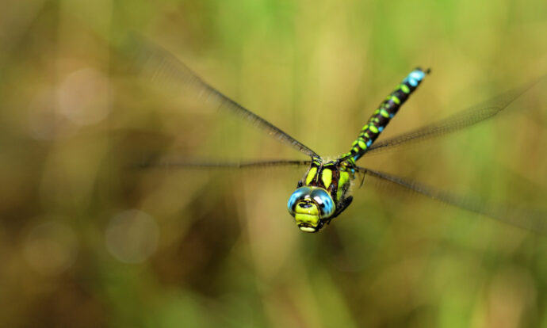

#  Dragon project repository 

Welcome to our GitHub repository! Here you can find resources related to the Dragon project.

> *Aeshna cyanea* :copyright: Martin Jeanmougin

## The project

The Dragon project studies anthropogenic impacts on freshwater ecosystems by focusing on odonates (dragonflies and damselflies). We aim to build a database of odonates occurrences across Europe, by engaging with national and regional organizations. These data will then be analyzed to obtain temporal occupancy trends for European odonates species, and link these trends with different pressures. Finally, we want to engage discussions to build a European indicator based on odonates to inform conservation and environmental management.

The Dragon project was selected from the [2022 FRB/MTE/OFB Impacts call](https://www.fondationbiodiversite.fr/en/calls/appel-a-projets-frb-mte-ofb-2022-impacts-sur-la-biodiversite-terrestre-dans-lanthropocene/).

## Members

Dragon is a collaborative project with 14 international members, listed below. The principal investigators are Colin Fontaine and Reto Schmucki, and Lisa Nicvert is the project postdoc.

<table>
  <tr>
    <td><b>Member</b></td>
    <td><b>Affiliation</b></td>
  </tr>
  <tr>
    <td>Aletta BONN</td>
    <td>iDiv, Germany</td>
  </tr>
  <tr>
    <td>Diana BOWLER</td>
    <td>UKCEH, United Kingdom</td>
  </tr>
  <tr>
    <td>Jason BRIED/td>
    <td>Illinois Natural History Survey, United States</td>
  </tr>
  <tr>
    <td>Aurélie COULON/td>
    <td>CEFE and CESCO, France</td>
  </tr>
  <tr>
    <td>Geert DE KNIJF/td>
    <td>INBO​​​​, Belgium</td>
  </tr>
  <tr>
    <td>Thore ENGEL/td>
    <td>iDiv, Germany</td>
  </tr>
  <tr>
    <td>Maxime FAJGENBLAT</td>
    <td>KU Leuven, Belgium</td>
  </tr>
  <tr>
    <td>Colin FONTAINE/td>
    <td>CESCO​​​​, France</td>
  </tr>
  <tr>
    <td>Martin JEANMOUGIN/td>
    <td>CESCO​​​​, France</td>
  </tr>
  <tr>
    <td>Aliénor JELIAZKOV/td>
    <td>INRAe​​​​, France</td>
  </tr>
  <tr>
    <td>Marie LAMOUILLE-HÉBERT</td>
    <td>FNE Haute-Savoie, France</td>
  </tr>
  <tr>
    <td>Lisa NICVERT</td>
    <td>FRB-Cesab, France</td>
  </tr>
  <tr>
    <td>Reto SCHMUCKI</td>
    <td>UKCEH, United Kingdom</td>
  </tr>
  <tr>
    <td>Roy VAN GRUNSVEN/td>
    <td>Dutch Butterfly Conservation​​​​, Netherlands</td>
  </tr>
 
</table>
